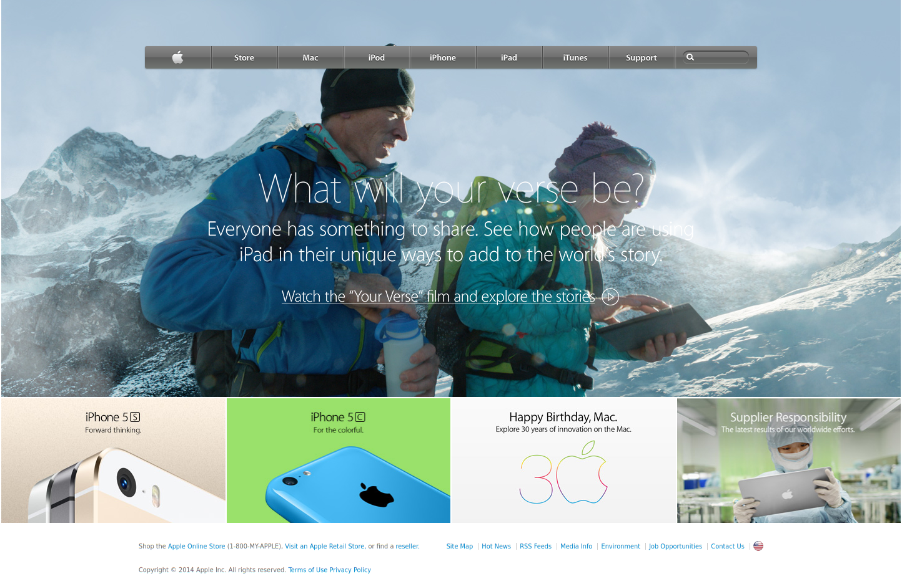

# Apple 2014 Homepage Clone v0.1.0

This is just a clone of the homepage of the 2014 version of [the apple website](http://archive.fo/UW4oR)

## Built With

- HTML, CSS

## Live Demo

[Live Demo Link](https://wintercore.github.io/microverse-backgrounds-and-gradients)

## Getting Started

To get a local copy up and running follow these simple example steps.

### Usage
- Just open the `index.html` file

## Commands
- `lintcss` Checks the css for any lint errors
- `lintcss:fix` Checks the css for any lint errors and tries to fix what it can

Note: You need to do `npm install` before executing the commands above.

## Authors

👤 **WinterCore**

- Github: [@WinterCore](https://github.com/WinterCore)

## 🤝 Contributing

Contributions, issues and feature requests are welcome!

Feel free to check the [issues page](issues/).

## Show your support

Give a ⭐️ if you like this project!

## Acknowledgments

- Hat tip to anyone whose code was used
- Inspiration
- etc

## 📝 License

This project is [MIT](lic.url) licensed.